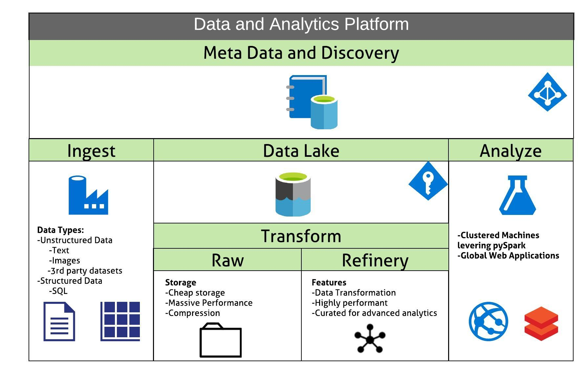
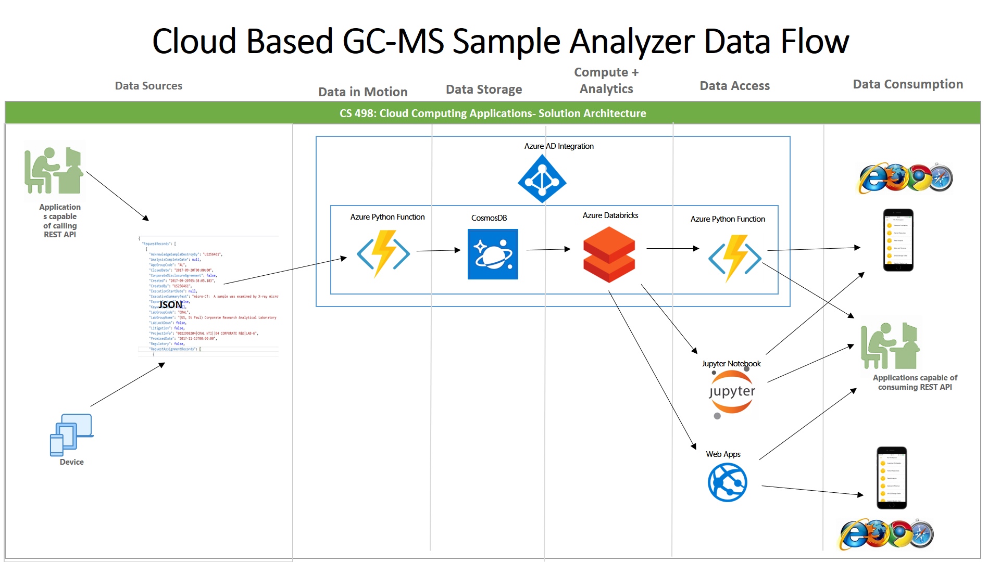
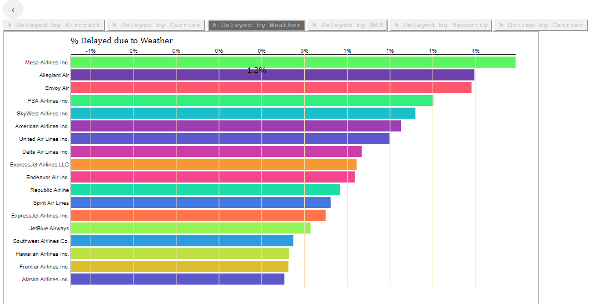
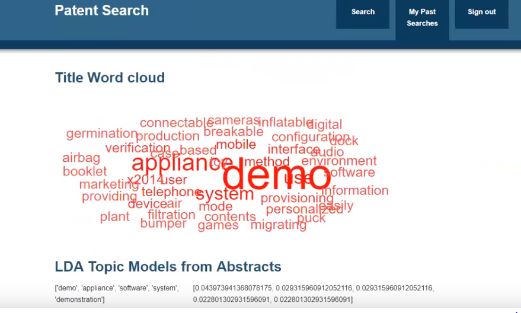

# Megan Masanz

## Work Related

- 2020 Microsoft Customer Hackathons

    - [Azure Data Factory CI/CD Pipeline Integration](https://memasanz.github.io/ADFCICID) - Data Factory pipelines with CICD Pipeline 
	
	- [Spark Streaming](https://memasanz.github.io/streaming_data/) - Event Generation to Event Hub, picked up via Spark Streaming & Leveraging Delta Lake

    - [Azure Data Factory Storage Queue Write-Up](https://memasanz.github.io/ADFToStorageQueueWriteUp/) - Leveraging Key Vaault and Rest APIs in ADF

    - [Azure ML Hackathon](https://memasanz.github.io/AMLHack/) - Azure ML: Building Basic Models in R & Python and Deploying

    - [Azure Data Bricks ML Flow](https://memasanz.github.io/AMLHackADBMLFlow/) - Databricks & ML Flow - Building and Deploying Models with Azure ML integeration

- 2019 Self-Service Data & Analytics Platform

    - Collection: Collecting data from disparate source systems

    - Organization: Business Driven data model supporting reliable and effective storage

    - Preservation: Automating tagging data-sets based on REST API meta-data collection to cataloging of datasets

    - Transformation: Support reformatting for use by different tools or to match new format standards

    - Workflow & Integration: Support the ability to systematize data workflows

    - Discoverability & Sharing: Support sharing data between researchers, teams, and business groups

    - Provenance: Support identifying what inputs and calculations are responsible for data values

    - Modification: Support management of corrections and updates

    - Compliance: Ensure compliance to legal, regulatory, and local policy requirements

    - Security: Ensure that data is secure from tampering or inappropriate access and distribution

## Education Related

Most repositories are marked as private, but repos can be made available apon request

**CS598 Data Curation**

- [CS598: Data Curation Course Certification](https://github.com/megado123/resume/blob/master/cs598_datacuration.pdf?raw=true)
  
- Examining theory behind dataset life-cycle management. 

- Exploring metadata to provide data linage and exploration. 

**CS498 Cloud Computing Applications**

- [CS498: Cloud Computing Applications Course Certification](https://github.com/megado123/resume/blob/master/cs498_cloudcomputing.pdf?raw=true)

- CS498: Final Project repo

- Project Data Flow

**CS498 Data Visualization**

- [CS498: Data Visualization Course Certification](https://github.com/megado123/resume/blob/master/cs498_datavisualization.pdf?raw=true)
- Leveraging D3 **without** the use of a web framework [website](https://megado123.github.io/)

**CS410 Text Information Systems**

- [CS410: Text Information Systems Course Certification](https://github.com/megado123/resume/blob/master/cs410_textinformationsystems.pdf?raw=true)

- [CS410: YouTube Video](https://www.youtube.com/watch?v=6pafuFNN4Dg&t=1430s)

- [CS410: Final Project repo](https://github.com/megado123/searchpatent)

- Flask python jinja2 web application utilizing Azure Search and D3 visualizations against Patent Database

 - Present form to end user for search criteria
 - Provide criteria to the Azure Search API and receive results set
 - Identify word tokens by frequency using the patent titles.
 - Identify topics in the search results. Latent Dirichlet Allocation (LDA) and the Hierarchical Dirichlet Allocation (HDP) - methods are utilized to generate topic models and both models are displayed.
 - Display results including patent meta data and patent abstract for browsing.

**Stats 420 Statistical Modeling in R**

- [Stats 420 Course Certification](https://github.com/megado123/resume/blob/master/stats420.pdf?raw=true)